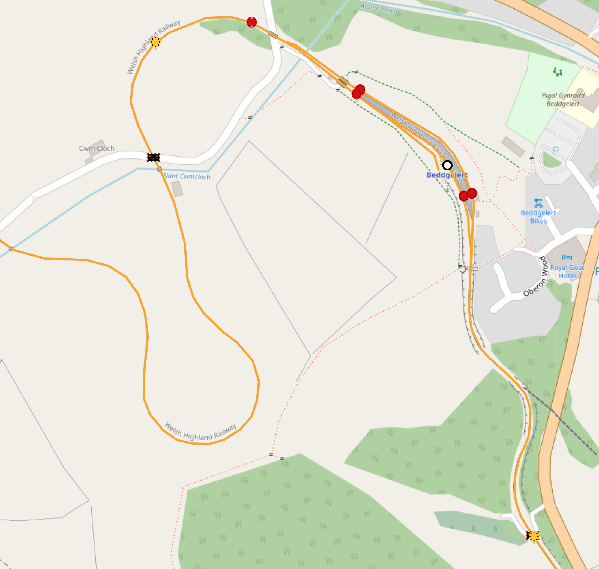

# OpenRailChart Project
|National Rail: Birmingham|Welsh Highland Railway: Beddgelert|
|---|---|
|||
|Demo of UK Mainline Signals|Demo of WHR style signals|

Experimental project to superimpose railway information on OpenStreetMap. I wanted to create a base from which I could build a UK icon scheme possibly for OpenRailwayMap.
The project makes use of Leaflet Javascript and uses tiles from the OSM server. A local database is built for nodes using `osm2pgsql` and then parsed using a python script to
extract the information needed to build the layers.

## Objectives

* Demo various signal types in situ.

* Provide enough previews to be able to present project to ORM/OSM rail community and hopefully get these into the UK map.

* Determine a good and complete tagging scheme for UK railway signals, development of such a tagging scheme can be found [here](https://github.com/artemis-beta/ukosmrailtags/).

## Running

Currently I use the `Live Server` plugin for VSCode to preview the project.

## Issues

I was unaware until later of the `-l` flag for `osm2pgsql` for latitude/longitude coordinates. As such the parser script assumes this has not been set when extracting Geofabrik data to the PostgreSQL database and converts the coordinates manually.
