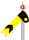
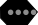

# UK Rail Icons for OpenRailwayMap

Below is a table of icons for the proposed tagging of railway signals in the UK, these icons have been created by the author and exist as both PNGs and SVGs.

The tags themselves are discussed within the tag proposal catalog [here](https://github.com/artemis-beta/ukosmrailtags/blob/master/Catalog.md).

## Signals

|Name|Description|Icon|
|:---:|:---| :---:|
|UK Main 3 Aspect (Old)|National Rail signal with 3 light apertures||
|UK Main 4 Aspect (Old)|National Rail signal with 4 light apertures||
|UK Main Multi Aspect (LED)|National Rail signal with 2 LED light apertures||
|UK Home Semaphore (Lower Quadrant)|BR(W) Semaphore home signal with off aspect at -45º||
|UK Distant Semaphore (Lower Quadrant)|BR(W) Semaphore distant signal with off aspect at -45º||
|WHR Stop Board (Old Style)| Welsh Highland Railway fixed stop board usually located at the end of a platform with a notice to obtain a token before proceeding||
|WHR Home Board| Welsh Highland Railway home board with lights||
|WHR Distant Board| Welsh Highland Railway distant board||

### Junction Fittings

Additions to signal types for junctions.
|Name|Description|Icon||Name|Description|Icon|
|---|---|---|---|---|---|---|
|Feather Position 1|Junction feather route 1|||Feather Position 4|Junction feather route 4||||||
|Feather Position 2|Junction feather route 2|||Feather Position 5|Junction feather route 5||||||
|Feather Position 3|Junction feather route 3|||Feather Position 6|Junction feather route 6||||||

## Signs

|Name|Description|Icon|
|:---:|:---| :---:|
|Turntable|For the rotation of trains||
|Buffers|Train buffers in one of many National Rail styles (Chose red and white as clear to see)||
|Level Crossing (Foot)|Point at which a footpath/pedestrian highway crosses a railway line||
|Level Crossing (Vehicle)|Point at which a road crosses a railway line (tags with `crossing:light=yes` rare, once common this will be required for icon to be displayed and a new symbol will exist for other crossings)||
|Whistle Board (Mainline)|Whistle board common to National Rail routes||
|Whistle Board (Sound Whistle)|"SW" whistle board mostly found on heritage railways||
|Whistle Board (Whistle)|"WHISTLE" whistle board mostly found on heritage railways||

## Stations

|Name|Description|Icon|
|:---:|:---| :---:|
|Railway Station|All railway stations||
|Tram Stop|All tramway stations||